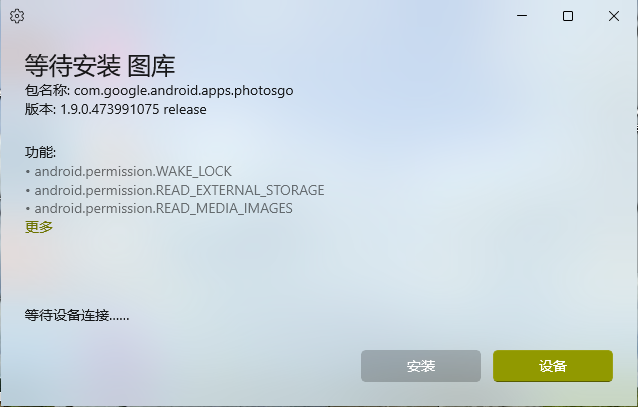

# 安装第三方软件

如今越来越多手机厂商在对安装第三方软件加以限制，以至于我们需要专门阅读文档应对这种情况。

::: tip
此页面是Android 通用的安装教程。您可能需要浏览专门针对您手机系统的文章，但推荐您先阅读完这篇文章后再阅读下面的文章。

- [EMUI、HarmonyOS、MagicUI、MagicOS 等 EMUI 系列](./emui.md) - 华为、荣耀
- MIUI - 小米

:::

## 安装本地软件

### 使用官方安装器安装

#### 一、开启安装权限

::: tip 此部分可以跳过
一般情况下您不需要手动开启安装权限。因为当需要安装软件时，系统会引导您直接开启权限。
<div class="screenshotList">

</div>
:::

::: tip
如果您使用的是 APKS 安装器，则需要授予安装器权限
:::

#### Android 7及以下

本段以 Android 4 和 Android 7 为例。

1. 点击“设置”图标，进入系统设置
    <div class="screenshotList">
    
    
    </div>
2. 点击“安全”页面，找到“未知来源”，将其开启/勾选
    <div class="screenshotList">
    
    
    
    
    </div>
    <div class="screenshotList">
    
    
    
    
    </div>

#### Android 8 及以上

本段以 Android 8 为例。

1. 点击“设置”图标，进入系统设置
    <div class="screenshotList">
    
    </div>
2. 进入“应用和通知”，点击“高级”（部分手机无此选项），找到“特殊应用权限”并进入
    <div class="screenshotList">
    
    
    
    </div>
3. 找到“安装未知应用”并进入，选择您用于安装第三方软件的应用，打开“允许来自此来源的应用”
    <div class="screenshotList">
    
    
    
    
    </div>

#### 二、开始安装软件

官方的安装器名称为“打包安装程序”、“软件包安装程序”或“应用安装器”。通常情况下，设备默认的就是官方的安装器。

直接点击 APK 文件即可使用官方安装器安装。

::: tip
如果您没有安装权限时，在打开 APK 文件后，系统会提示您开启权限，按照操作开启即可。
<div class="screenshotList">

</div>
:::

::: tip
部分操作系统限制了直接安装软件，因此您需要继续浏览[关于您设备的文章](#安装第三方软件)。
:::

::: tip

- 系统安装器一般不支持安装 APKS 安装包，因此需要[使用第三方安装器](#使用第三方安装器安装)来解决此问题。
- **华为用户**可以在关闭了纯净模式的前提下，使用**华为应用市场**的打开方式来安装 APKS 安装包。

:::

### 使用第三方安装器安装

主流的安装器：

- <ToolInfo name="InstallerX" /> <Badge type="tip" text="支持 APKS" />
- <ToolInfo name="SAI" /> <Badge type="tip" text="支持 APKS" />
- R-安装

::: details 还有一些文件管理也支持直接安装软件

- [MT 管理器](https://mt2.cn/) <Badge type="tip" text="支持 APKS" />：Android 平台文件管理 & 逆向修改神器

:::

这些第三方安装器一般都支持在文件管理内点击 APK 文件，直接调用第三方安装器安装软件

::: tip
某些手机厂商会强制锁定安装器为系统安装器，因此您在选择软件过程中需要选择“以其他方式打开”才能看到安装页面。

或者，您可以通过一些方法锁定第三方安装器
:::

::: danger
当您无法设置默认安装器的情况下，请不要尝试冻结“应用安装器”、“打包安装程序”等官方安装器，这种行为可能**导致部分数据丢失**（系统会自动重置），严重的会**卡开机动画**（系统不会会自动重置），并且 **ADB 也无法挽救**。
:::

## 通过电脑 (其他设备) 安装软件

如果您想直接把您的电脑上面的安装包安装到您的手机内，您可以使用 ADB 安装软件

::: tip
在使用 ADB 命令之前，请确保您已经安装了 [Platform-Tools](/tools/platform-tools.md)。
:::

常用命令：

```bash:no-line-numbers
adb install -r xxx.apk
```

这条命令的意思是：覆盖安装 `xxx.apk` 。

完整命令：

```bash:no-line-numbers
db install [-l] [-r] [-s] [--algo <algorithm name> --key <hex-encoded key> --iv <hex-encoded iv>] <file>
```

- `-l` 表示向前锁定应用程序
- `-r` 表示重新安装应用程序并保留其数据
- `-s` 表示着安装在 SD 卡上，而不是内部存储
- `--algo` 、`--key` 和 `--iv` 表示着文件已经加密

::: tip
您也可以使用 “APK 安装程序” 一键安装电脑上的软件到手机。

- <ToolInfo name="APK 安装程序-PC" />



一般的 APK 安装器都是基于 ADB 套壳的，稳定性都差不多，部分在购物平台上售卖的 APK 安装器在功能上和这个软件一模一样。
:::

:::: tip
使用 ADB 安装软件一般情况下不需要给予安装权限。但也有例外的情况。

::: details 例外情况

| 系统    | 版本 | 说明                                                                                                                   |
| ------- | ---- | ---------------------------------------------------------------------------------------------------------------------- |
| EMUI 类 | 未知 | 需要进入开发者选项关闭“监控 ADB 安装应用”，或者在每次安装时手动确认安装。 [查看详情](./emui.md#关闭-监控-adb-安装应用) |
| MIUI    | 未知 | 需要进入开发者选项打开“USB安装”，并在每次安装时手动确认安装。                                                          |

:::

::::

## 参考链接
