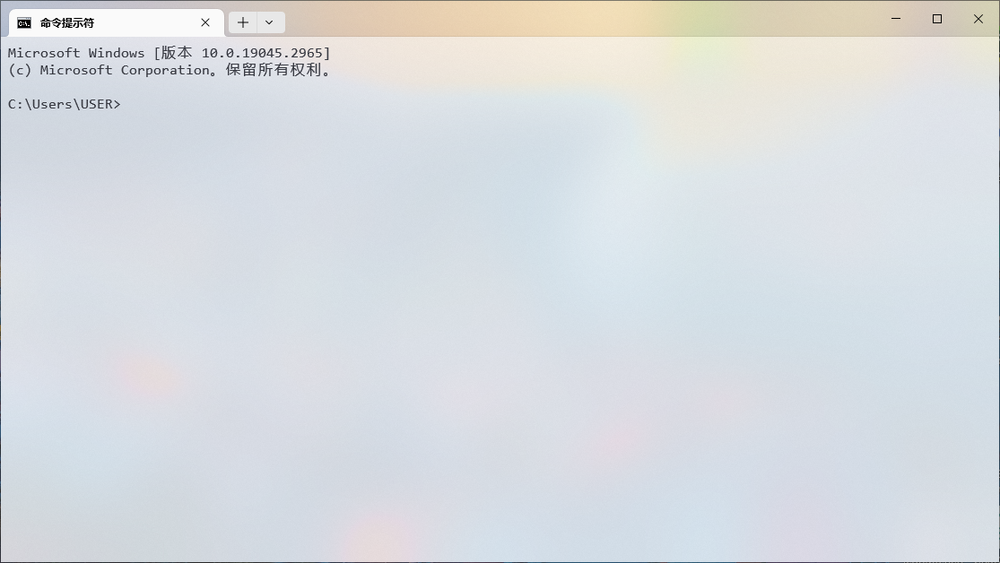

# 名词集

::: details 本页内容
[[toc]]
:::

百度百科的这篇已经很完善了，推荐看一看。<https://baike.baidu.com/item/%E5%88%B7%E6%9C%BA>

> 系列说明：这是名词集系列第一个收录名词，故在此写下该系列目的。该系列旨在用刷机的角度解释机圈术语或专有名词等，起工具性作用。由于作者认识浅薄，很多方面不能解释到十全十美，仅供参考。系列中收录的解决办法并非万能，请谨慎使用。

## Android 与安卓

::: details 一些介绍
[Android](https://source.android.google.cn/?hl=zh-cn)，读音：英：['ændrɔɪd]，美：[ˈænˌdrɔɪd]，原译为机器人，在香港通用原名「Android」，只有在中国大陆和台湾等华人地区使用非官方名称「安卓」，因此 __Android 基本等同于安卓__。这是一个基于 Linux 内核与其他开源软件的开放源代码的移动操作系统，由谷歌成立的开放手持设备联盟持续领导与开发，主要设计用于智能手机和平板电脑等触摸屏移动设备。

该操作系统的核心被称为 [Android 开源项目（AOSP）](https://source.android.google.cn/?hl=zh-cn)，是主要根据 [Apache 许可](https://apache.org/licenses/)获得许可的免费开源软件 (FOSS)。

然而，大多数设备运行由谷歌或其他供应商开发的专有 Android 版本，该版本预装了额外的专有闭源软件，最著名的是谷歌移动服务 (GMS)，其中包括谷歌浏览器等核心应用程序， 数字分发平台 Google Play，以及相关的 Google Play 服务开发平台。

虽然 AOSP 是免费的，但「Android」名称和徽标是 Google 的商标，Google 制定了标准来限制其生态系统之外的“未经认证”的设备使用 Android 品牌（[《内容许可》#限制](https://source.android.google.cn/license?hl=zh-cn#restrictions)）。

超过 70% 的基于 Android 开源项目的智能手机运行 Google 的生态系统（简称 Android），其中一些具有供应商定制的用户界面和软件套件，例如 TouchWiz 以及后来三星和 HTC Sense 的 One UI。

> 此处待查证
:::

::: details 一些历史

> 这些待查证

Android Inc.于2003年10月由安迪·鲁宾、利奇·米纳尔、尼克·席尔斯、克里斯·怀特在加州帕罗奥图创建。Android最初由安迪·鲁宾等人开发制作，最初开发这个系统的早期方向是创建一个数字相机的先进操作系统，但是后来发现相机市场规模不够大，加上智能手机发展趋势快速成长，于是Android成为一款面向智能手机的操作系统。于2005年7月11日Android Inc.被美国科技企业Google收购。

2010年末数据显示，仅正式推出两年的 Android 操作系统在市场占有率上已经超越称霸逾十年的诺基亚 Symbian 系统，成为全球第一大智能手机操作系统。

在2014年 Google I/O 开发者大会上 Google 宣布过去 30 天里有 10 亿台活跃的 Android 设备。

2017年3月，Android 全球网络流量和设备超越 Microsoft Windows，正式成为全球第一大操作系统。

截至2022年5月，根据 StatCounter 统计，除了美国、英国、加拿大、挪威、瑞典、丹麦、瑞士、科索沃、日本、台湾和澳大利亚外，在其他所有国家和地区 Android 都是最被广泛使用的智能手机操作系统。
:::

## 各式各样的「锁」

### Bootloader 锁

BootLoader 锁，简称“BL锁”。从字面意义上理解，是手机厂商对 BootLoader 程序运行的一种限制/锁定。

__作用：__

防止“篡改”官方 recovery 或“滥用” fastboot。

> 由于官方 recovery 的功能单一，且刷入刷机包时的签名验证十分严格，所以可以说是搞机路程上的第一道阻碍。

对于只想安安心心用手机，保护数据安全的普通用户，也起了到一定的保护作用。

__相关链接：__

* [解锁 Bootloader](/fast/unlock.md)

### 锁屏锁

这也是非刷机圈常说的“锁”。

### 账户锁

我不知道，等待补充

## 分区

Android 设备包含若干个分区，这些分区在启动过程中发挥不同的作用。

最常见的分区：

| 名称                                           | 俗称 | 说明                       |
| ---------------------------------------------- | ---- | -------------------------- |
| [boot](partitions/index.md#boot-分区)         | /    | 用于引导系统。             |
| [recovery](partitions/index.md#recovery-分区) | rec  | 用于恢复存储、进行系统更新 |
| [system](partitions/index.md#system-分区)     | /    | Android 系统存放的分区     |

::: tip
部分设备为了支持 A/B 更新，把 boot、system、vendor 和 radio 配置了两个槽位（如：`system_a`，`system_b`）。

> 此处等待查证

:::

* __ramdisk__：中文为虚拟硬盘，本质上是借用了部分机身存储（ROM）的空间，存放系统的缓冲文件。而存放于 `system` 分区下的 `ramdisk` 分区可以镜像部分操作系统驱动文件，帮助跑通 BootLoader 和 kernel 等开机引导程序。当然，当前手机厂商大肆宣传的运行内存拓展技术，也是基于一个 `ramdisk` 分区（作者本人不建议开启相关内存拓展技术）

> 此处等待查证

详情请阅读[《分区和映像》](./partitions/index.md)

## ROM、RAM

* __RAM__：全称 Random Access Memory，中文名随即存取存储器，是与 CPU 直接交互的存储结构，可以随意读取或写入，具有数据易丢失性（断电时存储在RAM中的数据会丢失），可以理解为 ROM 和 CPU 之间的临时桥梁，即运行内存。
* __ROM__：全称 Read Only Memory，中文名只读存储器，是手机的内部储存空间，存放着 Android 系统的所有分区及文件，当某文件需要交予 CPU 进行处理时，则需要先行写入 RAM 中，再被 CPU 所读取。（tip：刷机包也被称为 ROM 包，或简称为 ROM，也就是一个存放系统文件的文件包）

RAM 的性能和价格等各方面都高于 ROM，当然在手机上搭载的空间也更小。

ROM 的性能更弱，但是在空间大小和价格方面优势明显。

## ROOT

相关链接：

* [获取 Root](../fast/install/root/index.md)
* [Root 介绍](./root/index.md)

Root，也称为根用户，是 Unix (如 Solaris、AIX、BSD）和类 UNIX 系统(如 Linux、QNX 等)，及 Android 和 iOS 移动设备系统中的唯一的超级用户，因其可对根目录执行读写和执行操作而得名。其具有系统中的最高权限。（摘自[百度百科](https://baike.baidu.com/item/root/73226)）

一般来说，ROOT 可以表示一种较高级的 Android 用户权限，即“根权限”。也可以表示获取根权限的动作。

Android 删除了 `su` 程序，所以 Root 的过程就是把 `su` 文件放到 `/system/bin/` ，`Superuser.apk` 放到 `/system/app` 下面，还需要设置一些权限。（Android 5.0 之前的方法）

ROOT 的权限高于 [ADB（Android Debug Bridge）](../tools/platform-tools.md#adb-工具)权限，因此 ADB 无法完全代替 ROOT。

::: tip
您可以使用 [Shizuku](https://shizuku.rikka.app/zh-hans/) 将 ADB 权限共享给其他应用
:::

* __常见 ROOT 工具及 ROOT 管理工具__：
  * __Magisk__（内置 MagiskSU）: Magisk，别名叫做“面具”。这是目前主流的 Root 方式。<Badge type="tip" text="推荐" />
  * __KernelSU__: 这是新型 Root 方式。目前正在完善。<Badge type="tip" text="推荐" />
  * __SuperSU__: SuperSU，别名为“超级权限”。这是 Android 8.0 及之前管理 Root 的工具。<Badge type="warning" text="现如今几乎不可用" />
  * __SuperUser__: SuperUser，别名为“超级用户”，这是很多官方系统内置的授权管理工具（如 Phoenix OS，VMOS，天天模拟器）
  * __一键 Root 工具__:这是 Android 5 之前常用的获取 Root 方法 <Badge type="warning" text="现如今几乎不可用" />
* __兼容性__：
  * [兼容性表格](../fast/install/root/index.md#兼容性表格)

::: tip
有关 Magisk、KernelSU 等更多内容，请参考[《Root》](./root/index.md)。
:::

## 数据线

数据线不同于充电线。数据线可以传输数据，充电线则不能。

### USB 接口

USB的全称是 Universal Serial Bus，中文含义是“通用串行总线”。

#### Type-C 接口

Type-c 是一种既可以应用于 PC (主设备)又可以应用于外部设备(从设备，如手机)的接口类型，这是划时代的

> 也就是说，可以用个双头 Type-C 线连接两部手机，其中一个手机可以像电脑一样操控另一条手机

#### Micro-USB 接口

Micro-USB 是一种 USB2.0 标准接口，是 Mini-USB 的下一个版本

## 命令与终端

关于它们的定义，您可以查看[《Windows 控制台和终端定义》](https://learn.microsoft.com/zh-cn/windows/console/definitions)。

本文档内所有的命令都在终端内输入

### 关于终端

尽管 [shell、cmd 与终端的含义不同](https://www.zhihu.com/question/40448945)，但在一般情况下，人们会粗略地将这些名词划等号。

#### Windows 系统

1. 点击开始菜单或按 「Windows 徽标键+R」
2. 输入 `cmd` ，并打开或按下回车键
3. 在接下来弹出的窗口中输入您的指令

想要退出时直接关闭窗口即可

这是一个 Windows CMD 窗口（严格上来说是“控制台窗口主机”）的截图：

这是一个 Windows 终端的截图：

如果您使用的是 Windows 11+，您可以根据[《Windows11 设置 CMD 默认使用 Windows Terminal 启动》](https://blog.csdn.net/no1xium/article/details/123213625)将默认终端程序设置为 Windows 终端。

#### MacOS

在 Mac 上，请执行以下一项操作：

* 点按程序坞中的「启动台」图标 ，在搜索栏中键入「终端」，然后点按「终端」。
* 在「访达」 中，打开「/应用程序/实用工具」文件夹，然后连按「终端」。

想要退出时在「终端」App 中，选取「终端」>「退出终端」或输入 `exit` 命令。

#### Linux

__Linux用户还不会用终端？？？__

## 卡米

__定义和来源__：

在启动系统时卡在开机第一屏，这种情况发生在小米手机上，由于第一屏是小米 logo，故称“卡米”。

为什么会导致“卡米”

可能是由于 Android 系统分区中的 boot 分区受到损伤，无法完成开机 BootLoader 引导。

__解决办法__：

尝试长按“音量-”和“电源”键（小米/红米手机）进入 fastboot 刷机模式，重新线刷刷机包，重写 boot 分区，完成开机。

## 通用系统映像 (GSI)

敬请期待

__相关链接：__

* [通用系统映像 (GSI)](https://developer.android.google.cn/topic/generic-system-image?hl=zh-cn) - Android 开发者

## 版权声明

本文档已获得 [@灬只会刷机养老](http://www.coolapk.com/u/11090720) 授权搬运并修改整理

## 参考链接

* [【小白搞机入门】名词集-ROM、RAM、ramdisk](https://www.coolapk.com/feed/42682544?shareKey=ZjIwNzExZDUyYjczNjNkNTgzMTY~) - 酷安
* [【小白搞机入门】名词集-BootLoader锁（BL锁）](https://www.coolapk.com/feed/42674591?shareKey=YzQ2MThhNmI5MmNiNjNkNTcwOGM~) - 酷安
* [【小白搞机入门】名词集-卡米](https://www.coolapk.com/feed/42667909?shareKey=MWQ3MzZlMmQ4N2E2NjQ3OGI4NTg~)
* [root](https://baike.baidu.com/item/root/73226) - 百度百科
* [数据线](https://baike.baidu.com/item/%E6%95%B0%E6%8D%AE%E7%BA%BF/391946) - 百度百科
