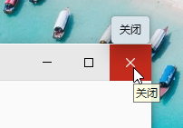
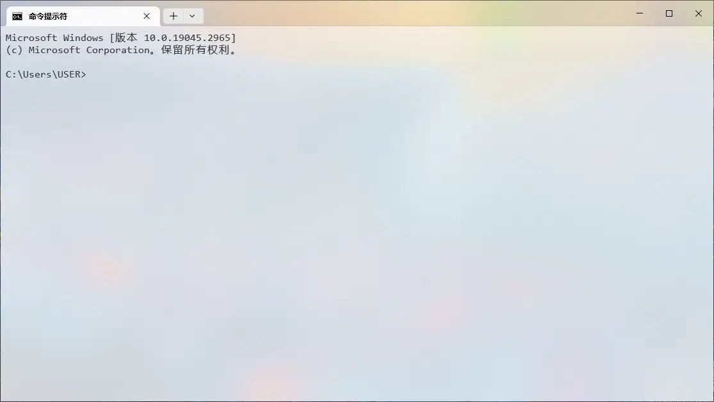

# 名词集

百度百科的这篇已经很完善了，推荐看一看。<https://baike.baidu.com/item/%E5%88%B7%E6%9C%BA>

> 系列说明：该系列旨在用刷机的角度解释机圈术语或专有名词等，起工具性作用。由于作者认识浅薄，很多方面不能解释到十全十美，仅供参考。系列中收录的解决办法并非万能，请谨慎使用，也欢迎点击底部“在 Gitee 上编辑此页面”帮我改正！

## Android 与安卓

### 什么是 Android 开源项目？

Android 开源项目 (AOSP) 是指打造出 Android 的人员、流程和源代码。

人员负责监督项目并开发源代码。流程是指 Google 为了管理软件的开发而使用的工具和程序。最终得到是可让您用于手机和其他设备的源代码。

### Google 为什么开放了 Android 源代码？

根据 Google 自己在开发移动应用方面的经验，Google 启动了 Android 项目。Google 希望确保始终有开放的平台可供运营商、原始设备制造商 (OEM) 和开发者使用，以便他们将创新的想法变为现实。另外，Google 也希望避免出现任何集中瓶颈，这样的话，就没有任何行业参与者可以一手限制或控制任何其他参与者开展创新。AOSP 有一个最重要的目标，那就是确保尽可能广泛地以兼容的方式实现 Android 开放源代码软件，使每个人都能从中受益。

::: details 一些介绍
[Android](https://source.android.google.cn/?hl=zh-cn)，读音：英：['ændrɔɪd]，美：[ˈænˌdrɔɪd]，原译为机器人，在香港通用原名「Android」，只有在中国大陆和台湾等华人地区使用非官方名称「安卓」，因此 Android 基本等同于安卓。这是一个基于 Linux 内核与其他开源软件的开放源代码的移动操作系统，由谷歌成立的开放手持设备联盟持续领导与开发，主要设计用于智能手机和平板电脑等触摸屏移动设备。

该操作系统的核心被称为 [Android 开源项目（AOSP）](https://source.android.google.cn/?hl=zh-cn)，是主要根据 [Apache 许可](https://apache.org/licenses/)获得许可的免费开源软件 (FOSS)。

然而，大多数设备运行由谷歌或其他供应商开发的专有 Android 版本，该版本预装了额外的专有闭源软件，最著名的是谷歌移动服务 (GMS)，其中包括谷歌浏览器等核心应用程序， 数字分发平台 Google Play，以及相关的 Google Play 服务开发平台。

虽然 AOSP 是免费的，但「Android」名称和徽标是 Google 的商标，Google 制定了标准来限制其生态系统之外的“未经认证”的设备使用 Android 品牌（[《内容许可》#限制](https://source.android.google.cn/license?hl=zh-cn#restrictions)）。

超过 70% 的基于 Android 开源项目的智能手机运行 Google 的生态系统（简称 Android），其中一些具有供应商定制的用户界面和软件套件，例如 TouchWiz 以及后来三星和 HTC Sense 的 One UI。

> 此处待查证

:::

::: details 一些历史

Android Inc.于2003年10月由安迪·鲁宾、利奇·米纳尔、尼克·席尔斯、克里斯·怀特在加州帕罗奥图创建。Android最初由安迪·鲁宾等人开发制作，最初开发这个系统的早期方向是创建一个数字相机的先进操作系统，但是后来发现相机市场规模不够大，加上智能手机发展趋势快速成长，于是Android成为一款面向智能手机的操作系统。于2005年7月11日Android Inc.被美国科技企业Google收购。

2010年末数据显示，仅正式推出两年的 Android 操作系统在市场占有率上已经超越称霸逾十年的诺基亚 Symbian 系统，成为全球第一大智能手机操作系统。

在2014年 Google I/O 开发者大会上 Google 宣布过去 30 天里有 10 亿台活跃的 Android 设备。

2017年3月，Android 全球网络流量和设备超越 Microsoft Windows，正式成为全球第一大操作系统。

截至2022年5月，根据 StatCounter 统计，除了美国、英国、加拿大、挪威、瑞典、丹麦、瑞士、科索沃、日本、台湾和澳大利亚外，在其他所有国家和地区 Android 都是最被广泛使用的智能手机操作系统。
:::

### 为什么市面上安卓系统这么少？

实际上有很多非常好用的安卓系统。[《操作系统概览》](./systems/index.md)列出了很多常见的安卓系统，以及其他非安卓系统。

## 各式各样的「锁」

### Bootloader 锁

BootLoader 锁，简称“BL锁”。从字面意义上理解，是手机厂商对 BootLoader 程序运行的一种限制/锁定。

**作用：**

防止“篡改”官方 recovery 或“滥用” fastboot。

> 由于官方 recovery 的功能单一，且刷入刷机包时的签名验证十分严格，所以可以说是搞机路程上的第一道阻碍。

对于只想安安心心用手机，保护数据安全的普通用户，也起了到一定的保护作用。

**相关链接：**

- [快速上手 > 解锁 Bootloader](../fast/unlock/index.md)

### 锁屏锁

这也是非刷机圈常说的“手机锁”。

### 账户锁

我不知道，等待补充

### 网络锁

我也不知道。虽然平常都是在说 iPhone 的网络锁，但是安卓也是有的。

## 分区

Android 设备包含若干个分区，这些分区在启动过程中发挥不同的作用。

最常见的分区：

| 名称                                          | 俗称         | 说明                       |
| --------------------------------------------- | ------------ | -------------------------- |
| [boot](partitions/index.md#boot-分区)         | 引导分区     | 用于引导系统。             |
| [recovery](partitions/index.md#recovery-分区) | rec/恢复分区 | 用于恢复存储、进行系统更新 |
| [system](partitions/index.md#system-分区)     | 系统分区     | Android 系统存放的分区     |

::: tip
部分设备为了支持 A/B 更新，把 boot、system、vendor 和 radio 配置了两个槽位（如：`system_a`，`system_b`）。
:::

- **ramdisk**：中文为虚拟硬盘，本质上是借用了部分机身存储（ROM）的空间，存放系统的缓冲文件。而存放于 `system` 分区下的 `ramdisk` 分区可以镜像部分操作系统驱动文件，帮助跑通 BootLoader 和 kernel 等开机引导程序。当然，当前手机厂商大肆宣传的运行内存拓展技术，也是基于一个 `ramdisk` 分区（作者本人不建议开启相关内存拓展技术）

> 此处等待查证

详情请阅读[《分区和映像》](./partitions/index.md)

## ROM、RAM

- **RAM**：全称 Random Access Memory，中文名随即存取存储器，是与 CPU 直接交互的存储结构，可以随意读取或写入，具有数据易丢失性（断电时存储在RAM中的数据会丢失），可以理解为 ROM 和 CPU 之间的临时桥梁，即运行内存。
- **ROM**：全称 Read Only Memory，中文名只读存储器，是手机的内部储存空间，存放着 Android 系统的所有分区及文件，当某文件需要交予 CPU 进行处理时，则需要先行写入 RAM 中，再被 CPU 所读取。

::: tip
刷机包也被称为 ROM 包，或简称为 ROM，也就是一个存放系统文件的文件包。
:::

- RAM 的性能和价格等各方面都高于 ROM，当然在手机上搭载的空间也更小。
- ROM 的性能更弱，但是在空间大小和价格方面优势明显。

## ROOT

相关链接：

- [Root 介绍](./danger_permissions/root/index.md)
- [百度百科](https://baike.baidu.com/item/root/73226)
- [获取 Root](../fast/install/root/index.md)

一般来说，ROOT 可以表示一种较高级的用户权限，即“根权限”。也可以表示获取根权限的动作。

ROOT 的权限高于 [ADB（Android Debug Bridge）](../tools/platform-tools.md#adb-工具)权限，因此 ADB 无法完全代替 ROOT。

Root 有很多工具，常见的有：[Magisk](./danger_permissions/root/index.md#magisk)、[KernelSU](./danger_permissions/root/index.md#kernelsu)

::: tip
有关 Magisk、KernelSU 等更多内容，请参考[《Root》](./danger_permissions/root/index.md)。
:::

## 命令与终端

简单来讲，命令就是**让电脑干一件事的“描述”**，终端就是**输入命令的地方**。

关于它们的定义，您可以查看[《Windows 控制台和终端定义》](https://learn.microsoft.com/zh-cn/windows/console/definitions)。

尽管 [shell、cmd 与终端的含义不同](https://www.zhihu.com/question/40448945)，但在一般情况下，人们会**粗略地将这些东西划等号**。

本文档内[所有的命令都在终端内输入](../faq/documents.md#命令的使用)。

::: tip
如果您想快速了解相关知识，建议观看尚硅谷的[《NodeJS入门：认识命令行工具》](https://www.bilibili.com/video/BV1gM411W7ex?p=6&vd_source=8a0088dd008c1b931f40fb1033994f70)视频
:::

### Windows 终端

Windows 命令行壳子有两种，一种是“命令提示符”（也叫“CMD”），一种是“PowerShell”

- **进入方法**：
  1. 点击「开始菜单」、「搜索」或者按「Windows 徽标键+R」
  2. 输入 `cmd` ，并按下回车键↵，即可进入终端。
    

    
    
    

- **退出方法**：直接关闭窗口即可
    

::: tip
这是一个「**Windows 控制台窗口主机**」的截图：

这是一个「**Windows 终端**」的截图：

如果您使用的是 Windows 11+ 或者 Windows10 19045.3086，您可以根据[《Windows11 设置 CMD 默认使用 Windows Terminal 启动》](https://blog.csdn.net/no1xium/article/details/123213625)将默认终端程序设置为 Windows 终端，这样您打开 CMD 时会自动打开更好看的 Windows 终端。
:::

::: tip
一般情况下，您可以直接将文件**拖入**终端内，快速输入文件路径

:::

::: tip
若使用 Powershell 而非 CMD，如果您想**运行工作目录下的软件**，请在每行命令前加 `./`。

如果您不知道上面这句话是什么意思，那就**不要使用 Powershell**。
:::

### MacOS 终端

在 Mac 上，请执行以下其中随便一项操作：

- 点按程序坞中的「启动台」图标 ，在搜索栏中键入「终端」，然后点按「终端」。
- 在「访达」 中，打开「/应用程序/实用工具」文件夹，然后连按「终端」。

想要退出时在「终端」App 中，选取「终端」>「退出终端」或输入 `exit` 命令。

### Linux 终端

- **Linux用户还不会用终端？？？**

## 卡 Mi、卡安卓

卡米就是在**启动系统时卡在开机第一屏**，这种情况发生在小米手机上，由于第一屏是小米 logo，故称“卡米”。

<!-- 可能是由于 Android 系统分区中的 boot 分区受到损伤，无法完成开机 BootLoader 引导。 -->

**解决办法**：

- 一般情况下长按“音量-”和“电源”键（小米/红米手机）[进入 fastboot 刷机模式（其他机型请点这里）](./modes/index.md#fastboot-模式)，重新线刷刷机包，尝试开机。
- 特殊情况下就需要对症下药了。您可以转到[《救砖指南》](/rescuing/index.md)

::: warning

- 实在不行，可以尝试售后
- 部分卡米无药可救，请谨慎刷机。

:::

## 通用系统映像 (GSI)

敬请期待

**相关链接：**

- [通用系统映像 (GSI)](https://developer.android.google.cn/topic/generic-system-image?hl=zh-cn) - Android 开发者

## TWRP

TWRP 是第三方 Recovery 的一种。有时使用 TWRP 代指第三方 Recovery

## 版权声明

本文档已获得 [@灬只会刷机养老](http://www.coolapk.com/u/11090720) 授权搬运并修改整理

## 参考链接

- [【小白搞机入门】名词集-ROM、RAM、ramdisk](https://www.coolapk.com/feed/42682544?shareKey=ZjIwNzExZDUyYjczNjNkNTgzMTY~) - 酷安：@灬只会刷机养老
- [【小白搞机入门】名词集-BootLoader锁（BL锁）](https://www.coolapk.com/feed/42674591?shareKey=YzQ2MThhNmI5MmNiNjNkNTcwOGM~) - 酷安：@灬只会刷机养老
- [【小白搞机入门】名词集-卡米](https://www.coolapk.com/feed/42667909?shareKey=MWQ3MzZlMmQ4N2E2NjQ3OGI4NTg~) - 酷安：@灬只会刷机养老
- [root](https://baike.baidu.com/item/root/73226) - 百度百科
- [数据线](https://baike.baidu.com/item/%E6%95%B0%E6%8D%AE%E7%BA%BF/391946) - 百度百科
- [常见问题解答](https://source.android.google.cn/docs/setup/about/faqs?hl=zh-cn#what-is-the-android-open-source-project) - Android 开源项目
- [Windows Terminal](https://github.com/microsoft/terminal) - Github：@Microsoft
- [Android Banner](https://platform-decentral.com/android-banner-2/) - Platform Decentral

声明：部分图片来源于网络。如果侵犯了您的权力，请[联系我](mailto:jesse205@qq.com)，我会尽快删除。
